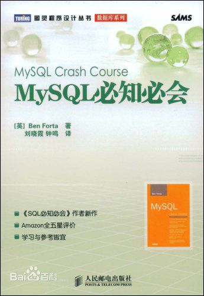
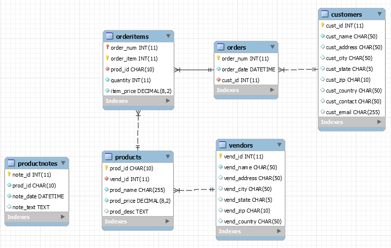

笔记来源于[《mysql 必知必会》](http://forta.com/books/0672327120/)

笔记中更多的是书中的知识的整理和记录，如有不对，请指导修正。

SQL语句不区分大小写，一般关键字使用大写，表和字段等用小写

[mysql官网](https://dev.mysql.com/)

[书中的建表文件和 insert 数据文件](http://forta.com/books/0672327120/mysql_scripts.zip)

6个表的数据

