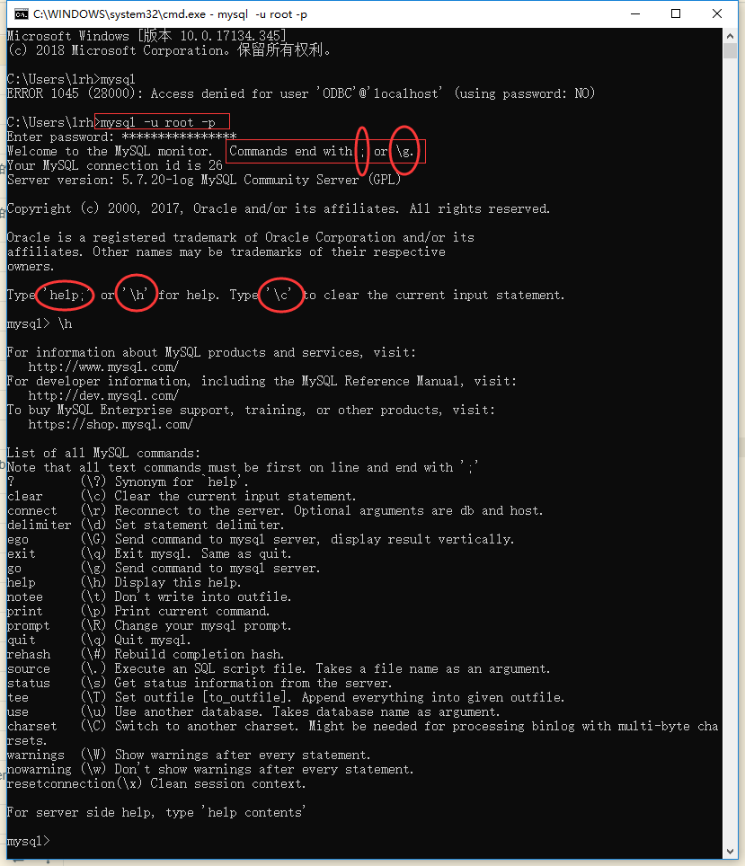
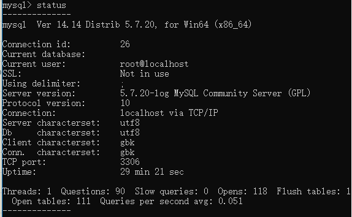
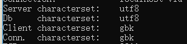
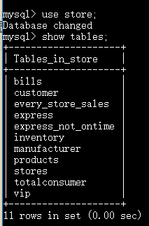
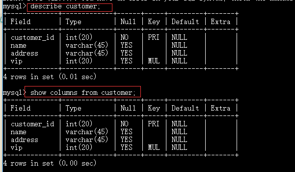
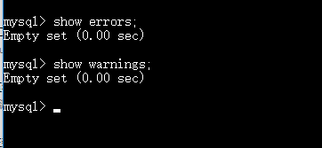
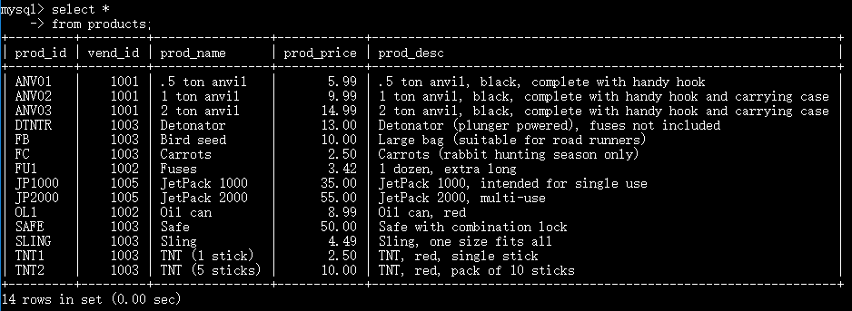
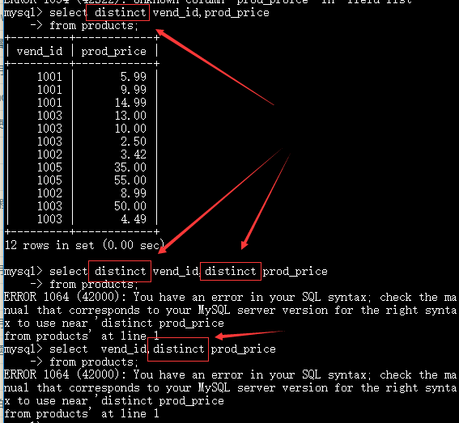
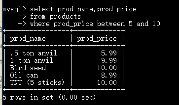

[TOC]

## 第一章了解 SQL

### SQL
结构化查询语言( Structured Query Language)

### 定义
数据库是一个以某种有组织方式存储的数据集合，或者说是保存有组织的数据的容器

### DBMS （Database Management System） 
数据库管理系统

### 表 table
某种特定类型数据的额结构化清单。

### 模式 scheme
关于数据库和表的布局及特性的信息。用来描述数据库总特定的表和整个数据库。

### 列 column
表由列组成，列中存储着表中的某部分的信息。所有的表都是由一列或者多列的属性构成，每一列对应着一种数据类型

### 数据类型 type
所容许的数据的类型，每一个表的每一列都有相应的数据类型，用于限制这一列中的数据的规范

### 行 row
表中的一个记录表示一行数据。数据都是按照行存储的，行的总数就是表的记录总数。

### 主键 primary key 
用来标识表中的唯一的数据的关键字或者关键字集合。
满足条件，才能成为主键
+ 表中任意两行都不具有相同的主键值。
+ 每个行都必须具有一个主键值（主键不允许为 null ）


--------------------------------------------------------------

## 第二章 MySQL简介

一种开源的 DBMS 软件

### 优点
+ 成本低，开源
+ 性能高，执行速度快
+ 可信赖，很多全球都有很多的社区
+ 简单，使用简单便捷

### 简单的使用
安装好 MySQL 软件之后，我们可以采用不同的方法使用数据库，这里列举两种
1. 使用命令行

打开命令行界面，在里面输入 mysql -u xxxx -p （,-u 后面是用户名 ，比如说 root ，-p 后面是密码）



命令中关键字 | 缩写符号 | 含义| 效果
:--------:|:----------:|:--------:|:---------:
clear | \c |清除当前命令的输入
connect | \r (reconnect)| 重新连接服务
delimiter| \d| 设置界定符号，默认是 ；|
exit\quit| \q|退出 mysql |
?\help| \h| 查看帮助|
go|\g| 执行当前的sql 语句，单纯的按 enter 键 不会执行，需要\g或者分号才会执行|
print |\p| 打印结果|
rehash| \#| 重新进行 hash 运算|
source |\.|执行一个 SQL 脚本文件|
status|\s|显示当前 mysql 的状态| 
charset |\C(注意大写)|设置语言| 
warnning\nowarnning|\W和\w|显示警告和不显示警告|


2. 使用可视化软件 比如说 workbench，Navicat 


------------------------------------------------

## 第三章 使用MySQL

### 登录
登录可以参照上面第二章 输入 mysql -u xxxx -p xxxxx 进行登录 

### 端口
默认是3306，可以修改

### 显示数据库信息 show
登录数据库之后，使用  **show** 关键字 查看 mysql 中一些信息
+ show databases ;


查看当前用户在 mysql 中可以查看的 schema ，有两个表特别注意，information_schema 和 performance_shema,这两个 schema 是 mysql 中固有的，都是一些与 mysql 相关的信息


主要是用户的一些操作记录等


关于一些系统的信息表，比如关于 innodb 等 


### 选择数据库 use
当登录到 mysql 的时候，没有指定到里面的哪个 schema，这个时候使用 **use** 关键字进行选择指定的 schema 模式。一般会有显示 database changed 


### 显示 schema 中的表数据
**show tables ；** 显示当前选择的数据库内的说列表 tables。



### 显示指定表的字段等类型
可以使用  **show columns from (table's name)**  或者  **decribe (tables's name)** 查看指定表中的每列的字段的数据类型和是否可以为 null 等。



### 显示当前用户的权限


### 显示错误和警告



### 显示广泛的服务器的状态信息
和单独输入 status 还是有区别的，小心混淆


### 总结
我们用 use 选择 数据库模式 ，用 show 查看数据库中的信息。

--------------------


## 第四章 检索数据 select
从一个表或者多个表格中查找数据

### 使用的格式

``` sql
select xxxx(表中的字段)
from xxx(表)
where xxxx(条件)
可以理解为：从xxx表中，选出符合xxxx条件的xxxx字段
```

### 检索单个列/单个字段

``` sql
select prod_name
from products;
```


不同设备的显示顺序可能不一样，但是总的条数是一样的

### 检索多个字段
检索多个列的时候，用逗号隔开对应的字段，最后一个字段后面不用跟逗号，否则异常。

``` sql
select xxxx,xxxxx,xxxx
from table's name;
```
demo

``` sql
select prod_id,prod_name,prod_price
from products;
```


显示的结果按照检索的字段顺序显示


### 检索出所有的列
如果知道表的所有字段，可以逐一列出所有的表的字段名来显示全部的结果，如果不知道所有的字段名，或者字段名太多，这个时候可以使用通配符 `*`来简化操作。

``` sql
select *
from table's name;
```
demo 

``` sql
select *
from products;
```


### 去重操作
如果你想知道不同的值，而不是重复出现的值，这个时候你可以进行去重操作

``` sql
select distinct xxxx字段
from xxx表
```
demo

``` sql
select distinct vend_id
from products;
```


**注意：distinct 放置于所有的字段前面，应用于全部的列，也就是说，所有字段中保证唯一的一行，而不是保证每一列都是唯一的。**



### 限制结果
如果不加限制的话，select之后会返回全部的列可能会比较多，但是我们可以通过 limit 字段进行适当的分段，来达到数据分页的效果。

``` sql
select xxx字段
from xxx表
limit [n,m];
如果 limit 字段后面只有一个数字，相当于只返回 0-n,的数据，如果有两个数字，则返回从 n 起的 m 行。如果不够就有多少返回多少。也可以使用 limit n offset m 这样直观一些。
```

demo


### 使用完全限定的表名
之前我们使用的都是直接使用字段名，也可以使用完全限定的表名。这种情况更多是用在多表联合操作的时候，两个表都有相同的字段的时候为了更好的区分他们需要加上表的名字，如果字段是唯一的，可以不用加上表的字段。

demo

``` sql
select products.prod_id
from products;
```


-----------------------------------------

## 第五章排序检索 order by

### 单个排序

如果我们没有进行特定的检索排序，系统会默认返回底层的排序结构数据回来，不同机子的顺序不一样，如果我们指定使用升序或者降序那么返回结果就会按照格式返回数据。排序顺序是 符号>数字>字母(大小写不区分，如果要区分需要自己设置区分大小写)

默认结果


排序结果


### 多个排序

对多个字段进行排序，只需要在 order by 后面加上对应的字段就好了，用逗号分隔。

``` sql
select xxx,xxx,xxx字段
from xxx表
order by xx,xx
```
demo

``` sql
select prod_id,prod_price,prod_name
from products
order by prod_price,prod_name;
```


通过结果我们知道，系统是按照第一排序序列，第二排序序列这样排序下去的，也就是说第二排序序列是在第一排序序列的基础上在调整的。

### 指定排序的方向
默认排序的方向都是升序的  ，如果需要降序的需要再对应的字段后面添加 desc 关键字。因为默认是升序的，所以加不加 asc(ascending) 关键字都没所谓。

``` sql
select xxx,xxx,xxx字段
from xxx表
order by xxx desc,xxxx desc,xxx;
```

demo


#### 结合排序可以找出最xxx的前几名结果

``` sql
select xxx，xxx,xxx
from xxx
order by xxx
limit xxx;
```

demo
找出 products 中最贵的和最便宜的三个商品

``` sql
select prod_name.prod_price
from products
order by prod_price desc
limit 3;
```


``` sql
select prod_name.prod_price
from products
order by prod_price 
limit 3;
```


## 第六章 过滤数据 where
如果没有过滤条件我们会返回所有的数据，但是一般不会用到全部的数据，所以我们需要添加上一些限制条件过滤指定的数据，返回更加精简的数据。

``` sql
select xxx,xxxx,xxx
from xxx
where xxx;
```

### where 条件的操作符
操作符|说明
:-----:|:----:
= | 等于
<>/!= | 不等于
< | 小于
<= | 小于等于
> | 大于
>= | 大于等于
between n and m | 在[n,m] 之间的数值

### 应用例子

``` sql
select prod_name,prod_price
from products
where prod_price=2.5;
```


``` sql
select prod_name,prod_price
from products
where prod_name='fuses';
```


可以看出字母是不区分大小写的

其他demo


不等于

``` sql
select vend_id,prod_name
from products
where vend_id <> vend_id;
```


between xxxx and xxxx

``` sql
select prod_name,prod_price
from products
where prod_price between 5 and 10;
```


### 空操作
有些字段中没有包含值，这种区别于 数字 0，空字符串，空格等，他它是没有数据在里面的。

判断空
``` sql
select prod_price
from products
where prod_price is null;
```
判断非空
``` sql
select prod_price
from products
where prod_price is not null;
```


## 第七章 数据过滤
第六章中讲述的更多的是单个条件的过滤情况，下面讲述跟多的过滤条件的情况。这里主要用到 AND /OR /NOT/ IN 这几个关键字。

### AND 操作符
和我们常规的逻辑运算一致，AND 操作符也是表示两个条件之间的并列情况，即两个条件同时为真才能满足,如果添加多个条件，则在每两个条件之间都 添加一个 AND。

``` sql
select xxx,xxxx,xxx
from xxx
where xxx and xxx and xxx;
```

demo

``` sql
select vend_id,prod_id,prod_price
from products
where vend_id=1003 and prod_price<=10
order by prod_price;
```


### OR 操作
OR 操作和逻辑运算的或差不多，表示两个条件之间只要有一个条件成立即可成立。如果需要并列多个条件，同样也是直接在每两个条件之间添加一个 OR 操作。

``` sql
select xxx,xxxx,xxxx
from xxx
where xxx or xxx or xxxx;
```
demo

``` sql
select vend_id,prod_id,prod_price
from products
where vend_id=1002 or vend_id=1003
order by vend_id,prod_price;
```


### 计算次序
如果条件中同时包含有 AND / OR  的情况的，则同样按照逻辑运算的顺序去进行，AND 的优先级比 OR 级别高，如果要让 OR 条件先执行，则需要添加小括号进行限定，因为小括号的优先级更高。

对比

and_or
``` sql
select vend_id,prod_id,prod_price
from products
where vend_id=1002 or vend_id=1003 and prod_price>=10
 order by vend_id;
```
or_and

``` sql
 select vend_id,prod_id,prod_price
from products
where (vend_id =1002 or vend_id=1003) and prod_price>=10
order by vend_id;
```


### IN 操作
in 操作表示条件是否在指定的范围内，范围是闭区间的，范围值可以用逗号隔开，包在圆括号里面。他的作用和 or 操作相似，可以替换

``` sql
select xxx,xxx,xxx
from xxx
where in (n,m);
```

demo


可以发现 in 操作和 or 操作结果都是一样的。

in 操作的优点
+ 语句精简，直观清楚
+ 比 or 操作符更加的快
+ in 可以与子查询等结合，发挥更强大的作用

### NOT 操作
和逻辑否定词一样，都是对条件的否定，即将选出不在条件范围内的数据

``` sql
select xxx,xxx,xxx
from xxxx 
where not xxx;
```


not 一般结合 in 使用比较灵活和方便。


## 第八章 通配符进行数据过滤
如果进行不明确的数据搜索的时候，或者我们不知道具体是否含有某个字段的情况下，我们可以采用模糊搜索。

### 通配符
用来匹配值的一部分的特殊字符。

### 搜索模式
有字面值。通配符或者两者组合而成的搜索条件。

使用通配符一般是结合 LIKE 关键字进行使用的

### % 通配符
% 通配符是表示任意字符出现的次数。通配符可以出现在前面，后面，中间，或者组合出现。**一般不区分大小写**。

**注意：空格和null,空格也是一个字符来的，记得去掉不必要的空格，null 不能通过 like 来匹配**

``` sql
select xxx,xx,xxx
from xxxx
where xxx like '%xx%xx%';
```

demo


### 下划线 （_）通配符
下划线通配符只能匹配一个字符，%可以匹配 0 - n 个字。同样，位置可以灵活的放在前中后等位置

``` sql
select xxx,xxxx,xxx
from xxx
where xxx like '_xxx_xx_xxxx_';
```
demo


### 使用技巧
+ 通配符搜索比较慢，使用的时候需要谨慎
+ 模式匹配不要放在最开始的搜索，可以先执其他搜索，然后在进行模糊搜索，缩小搜索的范围，提高速度


## 第九章 正则表达式

正则表达式是用来匹配文本的，将一个一个模式与文本文串进行比较，一般应用在 where 子句中。正则表达式和模糊匹配有点类似，但是又不完全相同

### 基本字符匹配


### like 和正则表达式的小区别
like 模糊搜索一般和 通配符一起结合使用的，正则表达式一般是按照某种模式，进行匹配，匹配成功则返回数据。


### 区分大小写
默认不区分大小写，如果需要区分大小写，则使用 BINARY 关键字，在制定的字符串前面修饰。


### OR匹配
搜索几个条件之一，使用  | 符。 类似逻辑运算符的 or ，同样的，如果有多个的条件，也是用多个 | 进行区分


### 匹配几个字符之一
如果箱匹配单一的一个字符，可以用 [ ] 来限定。这种形式可以理解为 or 的特例，只是他限定的是单个的字符，or 是可以任意的。


### 特殊字符
特殊字符需要加上转义字符 ，MySQL 中需要两个转义字符，`\\`,一个是 MySQL 系统识别，一个转义系统识别

符号|在 MySQL 中表示
:-----|:-----
. | `\\.`
- | `\\-`
\ | `\\\`
`|`  | `\\|`
[  | `\\[`
] | `\\{`
换页 | `\\f`
换行 | `\\n`
回车 | `\\r`
制表 | `\\t`
纵向制表 | `\\v`

### 匹配字符类
类|说明
:----|:---
[:alnum:] | 任意字母和数字 （同[a-zA-Z0-9]）
[:alpha:] | 任意字母 （同[a-zA-Z]）
[:blank:] | 空格和制表 （同[`\\t`]）
[:cntrl:] | 控制字符 （ASCII 0-31 和 127）
[:digit:] | 任意数字 （同[0-9]）
[:lower:] | 任意小写字母 （同[a-z]）
[:upper:] | 任意大写字母 （同[A-Z]）
[:print:] | 任意可以打印的字符
[:graph:] | 除去空格外的任意字符
[:punct:] | 非数字非字母非控制符
[:space:] | 包括空格在内的空白字符 （同[`\\f\\n\\r\\t\\v`]）
[:xdigit:] | 十六进制数字

### 匹配多个实例
元字符| 说明
:----|:----
.| 匹配任意一个字符
* |  0个或者多个
+ | 正数个，排除 0 个
? | 类似布尔值 0或1
{n} |n个
{n,}| n个以上
{n,m}| 【n,m】闭区间


### 定位符
定位到特定位置的符号
元素据 | 说明
:-----|:------
^ | 文本开始，和否定一样
$ | 文本结束
[[:<:]] | 单词开始
[[:>:]]| 单词结束

