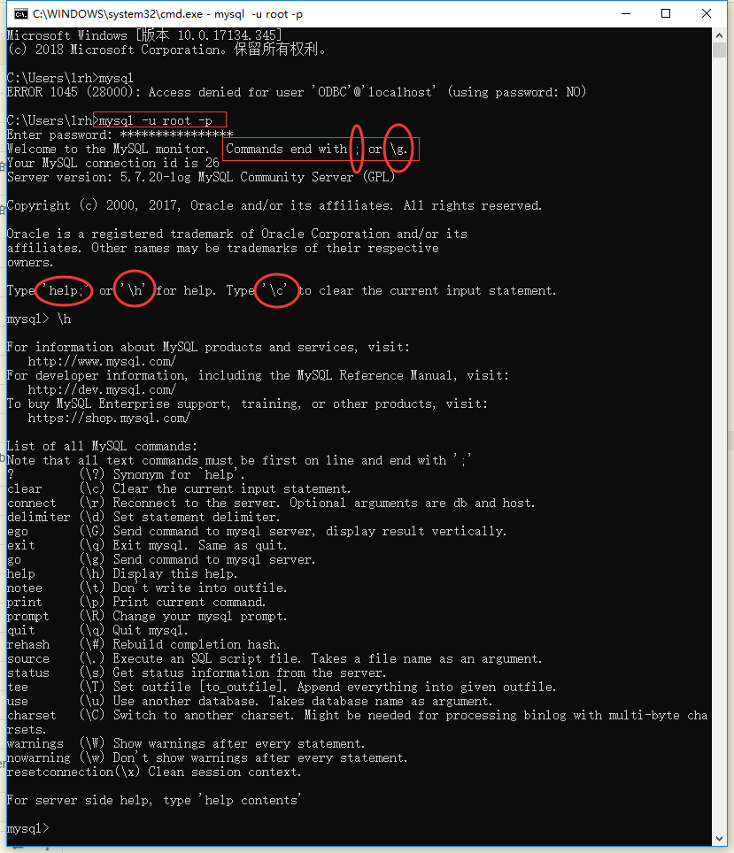
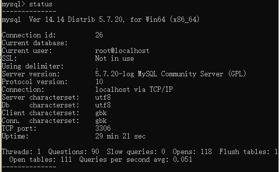
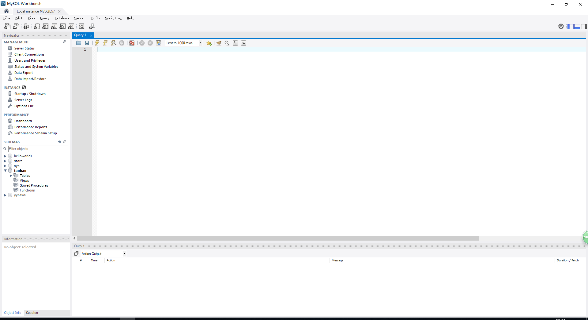
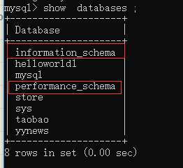
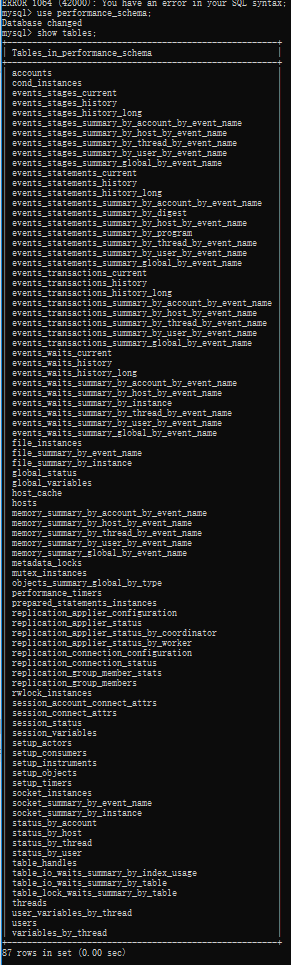
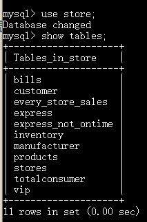
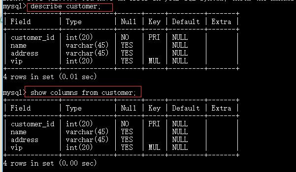
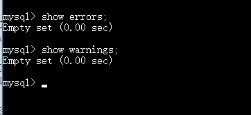

[TOC]

## 第一章了解 SQL

### SQL
结构化查询语言( Structured Query Language)

### 定义
数据库是一个以某种有组织方式存储的数据集合，或者说是保存有组织的数据的容器

### DBMS （Database Management System） 
数据库管理系统

### 表 table
某种特定类型数据的额结构化清单。

### 模式 scheme
关于数据库和表的布局及特性的信息。用来描述数据库总特定的表和整个数据库。

### 列 column
表由列组成，列中存储着表中的某部分的信息。所有的表都是由一列或者多列的属性构成，每一列对应着一种数据类型

### 数据类型 type
所容许的数据的类型，每一个表的每一列都有相应的数据类型，用于限制这一列中的数据的规范

### 行 row
表中的一个记录表示一行数据。数据都是按照行存储的，行的总数就是表的记录总数。

### 主键 primary key 
用来标识表中的唯一的数据的关键字或者关键字集合。
满足条件，才能成为主键
+ 表中任意两行都不具有相同的主键值。
+ 每个行都必须具有一个主键值（主键不允许为 null ）

--------------------------------------------------------------

## 第二章 MySQL简介

一种开源的 DBMS 软件

### 优点
+ 成本低，开源
+ 性能高，执行速度快
+ 可信赖，很多全球都有很多的社区
+ 简单，使用简单便捷

### 简单的使用
安装好 MySQL 软件之后，我们可以采用不同的方法使用数据库，这里列举两种
1. 使用命令行

打开命令行界面，在里面输入 mysql -u xxxx -p （,-u 后面是用户名 ，比如说 root ，-p 后面是密码）

命令中关键字 | 缩写符号 | 含义| 效果
:--------:|:----------:|:--------:|:---------:
clear | \c |清除当前命令的输入
connect | \r (reconnect)| 重新连接服务
delimiter| \d| 设置界定符号，默认是 ；|
exit\quit| \q|退出 mysql |
?\help| \h| 查看帮助|
go|\g| 执行当前的sql 语句，单纯的按 enter 键 不会执行，需要\g或者分号才会执行|
print |\p| 打印结果|
rehash| \#| 重新进行 hash 运算|
source |\.|执行一个 SQL 脚本文件|
status|\s|显示当前 mysql 的状态| 
charset |\C(注意大写)|设置语言| 
warnning\nowarnning|\W和\w|显示警告和不显示警告|

2. 使用可视化软件 比如说 workbench，Navicat 

------------------------------------------------

## 使用MySQL

### 登录
登录可以参照上面第二章 输入 mysql -u xxxx -p xxxxx 进行登录 

### 端口
默认是3306，可以修改

### 显示数据库信息 show
登录数据库之后，使用  **show** 关键字 查看 mysql 中一些信息
+ show databases ;

查看当前用户在 mysql 中可以查看的 schema ，有两个表特别注意，information_schema 和 performance_shema,这两个 schema 是 mysql 中固有的，都是一些与 mysql 相关的信息

主要是用户的一些操作记录等

关于一些系统的信息表，比如关于 innodb 等 

### 选择数据库 use
当登录到 mysql 的时候，没有指定到里面的哪个 schema，这个时候使用 **use** 关键字进行选择指定的 schema 模式。一般会有显示 database changed 

### 显示 schema 中的表数据
**show tables ；** 显示当前选择的数据库内的说列表 tables。

### 显示指定表的字段等类型
可以使用  **show columns from (table's name)**  或者  **decribe (tables's name)** 查看指定表中的每列的字段的数据类型和是否可以为 null 等。

### 显示当前用户的权限

### 显示错误和警告

### 显示广泛的服务器的状态信息
和单独输入 status 还是有区别的，小心混淆

### 总结
我们用 use 选择 数据库模式 ，用 show 查看数据库中的信息。

--------------------